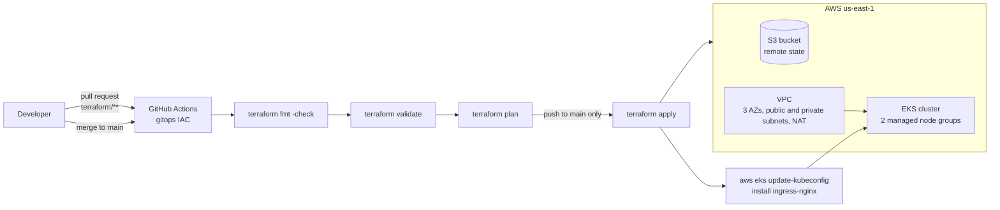

# AWS EKS with Terraform and a GitOps pipeline

Infrastructure as code for an **Amazon EKS (Kubernetes) cluster on AWS**, provisioned with **Terraform** and driven entirely by **GitHub Actions**: every change to the infrastructure is checked on a pull request, planned, and applied automatically when it lands on `main`.

The cluster is the runtime for the [vprofile](https://github.com/hkhcoder/vprofile-project) sample application (a Java / Spring MVC app with MySQL, Memcached and RabbitMQ) used in DevOps course material.

## How it works



| Event | What runs |
|---|---|
| Pull request to `main` touching `terraform/**` | init, format check, validate, plan (nothing is applied) |
| Push to `main` or `stage` touching `terraform/**` | the same checks and plan |
| Push to `main` | additionally **apply**, then fetch the cluster's kubeconfig and install the NGINX ingress controller |

A failed plan fails the job explicitly (the plan step is allowed to fail so the pipeline can report it cleanly).

## What gets provisioned

| Layer | Details | Source |
|---|---|---|
| Remote state | S3 backend, bucket supplied at `terraform init` time | `terraform/terraform.tf` |
| Network | VPC `172.20.0.0/16` across 3 availability zones, 3 private and 3 public subnets, single NAT gateway, subnet tags for Kubernetes load balancers | `terraform/vpc.tf` (module `terraform-aws-modules/vpc/aws` 5.1.2) |
| Cluster | EKS 1.27 in the private subnets, two managed node groups of `t3.small` (1-3 and 1-2 nodes) | `terraform/eks-cluster.tf` (module `terraform-aws-modules/eks/aws` 19.19.1) |
| Outputs | Cluster name, endpoint, security group ID and region | `terraform/outputs.tf` |

## Setup

1. Create an S3 bucket for the Terraform state.
2. Add these **repository secrets** in GitHub (Settings, Secrets and variables, Actions):
   - `AWS_ACCESS_KEY_ID`
   - `AWS_SECRET_ACCESS_KEY`
   - `BUCKET_TF_STATE` (the bucket from step 1)
3. Adjust `region` and `clusterName` in `terraform/variables.tf` if you do not want the defaults (`us-east-1`, `iac-actions-eks`), and the matching `AWS_REGION` / `EKS_CLUSTER` values in `.github/workflows/terraform.yml`.
4. Push a change under `terraform/` to `main`.

To run the same steps locally:

```bash
cd terraform
terraform init -backend-config="bucket=<your-state-bucket>"
terraform fmt -check
terraform validate
terraform plan -out planfile
terraform apply planfile
```

Tear everything down when you are finished, because an EKS control plane, a NAT gateway and worker nodes are billed by the hour:

```bash
terraform destroy
```

## Notes and known limits

- **Versions are pinned to late-2023 releases** (Terraform AWS provider 5.25, EKS module 19.19, Kubernetes 1.27). AWS retires old Kubernetes versions, so bump `cluster_version` and the module versions before using this today.
- The pipeline authenticates with long-lived AWS access keys stored as secrets. Switching to GitHub's OIDC federation with an IAM role would remove the stored keys and is the natural next step.
- The application deployment (Docker image build, Helm chart) is a separate concern from this infrastructure repository.

## Credits

The VPC and EKS layout follows the structure of HashiCorp's "Provision an EKS cluster with Terraform" guide, and the sample application is the open-source vprofile project. Pipeline wiring, remote state and ingress setup were assembled while learning the GitOps workflow for AWS.
